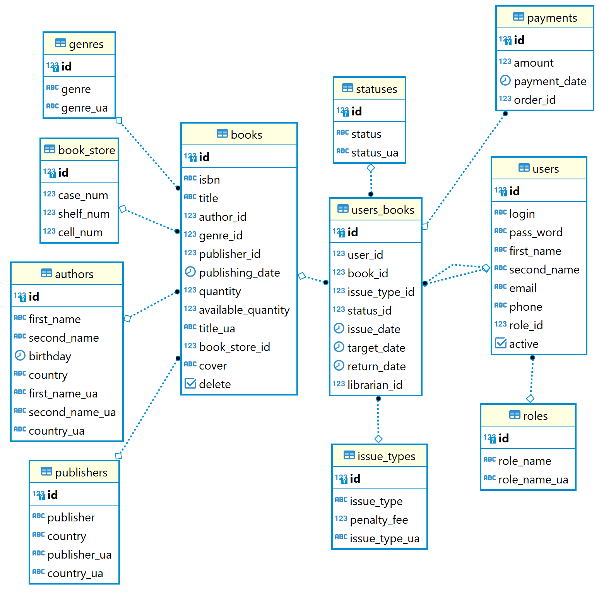

# library

<h4>Library</h4>

Course project for EPAM JAVA BASIC 2022.

Regarding the <a href= "https://github.com/DenysFilimonov/library/blob/029ccf88d5e3dc8fcd479d2964066dfd23e36d4b/Library.docx">project description</a>, 
application implements solution of basic processes automation for offline library.

Using features of Library-app readers can easily look for books in library catalog and operate with them. the library staff can perform operations with catalog, storing, releasing and retrieving books.

<h5>Technology stack used in this project:</h5>

<ul>
  <li>PostgreSQL - BD engine</li>
  <li>Java servlet, jsp&jstl  - backend</li>
  <li>Apache Tomcat - servlet container</li>
  <li>Javascript&Bootstrap -frontend</li>
</ul>  

<h5>Implementation details</h5>
BD scheme 

<h5>Back end server</h5>

<ul>
  <li>Build with MVC scheme</li>
  <li>PRG pattern used for processing input forms</li>
  <li>dbcp2 connection pool</li>
  <li>SHA-256 passwords encryption</li>
  <li>Custom jstl tags</li>
  <li>Server side pagination</li>
  <li>Server side page validation</li>
</ul>  

<h5>Front end</h5>

<ul>
  <li>Css styling and modal windows based on Bootstrap</li>
  <li>Links dispatching, front-end form validations with Java Script</li>
</ul>  

<h5>How install & launch</h5>
<ul>
  <li>Clone repository</li>
  <li>In Local or remote PostgreSQL instance restore from <a href = "https://github.com/DenysFilimonov/library/blob/master/dump-library-202301241406">dump</a></li>
  <li>Set your DB credentials in resource/db.properties</li> 
  <li>Build package with maven</li>
  <li>Rollover Library.war on Apache Tomcat</li>
</ul>
